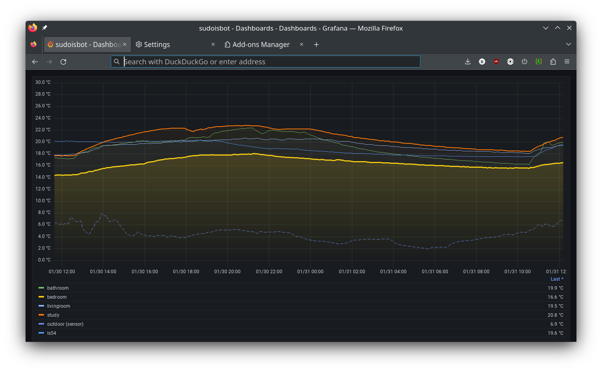

# sudoisbot

this is a home monitoring system written in Python and using
[ZeroMQ](https://www.zeromq.org).

_NOTE: this project will be renamed, most likely to `roomie`._

## FAQ: why zmq? dont you know about mqtt?

because i wanted a project to learn zeromq. i am aware of mqtt and
that it is designed for things like this.

## what is running where?

as this project hasnt been actively worked on for a while, things have
drifted a little bit. here are some notes for myself.

 * the sensors are _most likely_ running on commit
   52462cb3d9cee0fc68b7cc908ffe86e95d746bc5 (tagged as
   `prod-sensors`).

 * the `sink` component **was** running on commit
   c5e9d2b4124edb97bbade79a70dfada9080511d5 (also tagged as
   `prod-sink` and branched as `prod-sink` as well).

    **this is no longer true**, sink is running off the `main` branch as of commit 0287dc196914efba4407908e020c146b1733e7ac

## related projects

 * [zflux](https://git.sudo.is/ben/zflux): a buffering proxy (using
 zmq) to gracefully handle network failures, and can also do load
 balancing.

 * [shared-jenkins-pipelines](https://git.sudo.is/ben/shared-jenkins-pipelines):
 jenkins delcarative pipelines, including the
 [`poetry.groovy`](https://git.sudo.is/ben/shared-jenkins-pipelines/src/branch/main/vars/poetry.groovy)
 pipeline used to build this project.

## notes

its bedroom and ls54 that cache more and better on disconnets

## architecture

  * proxy
  * sink
  * sensor
  * apis
