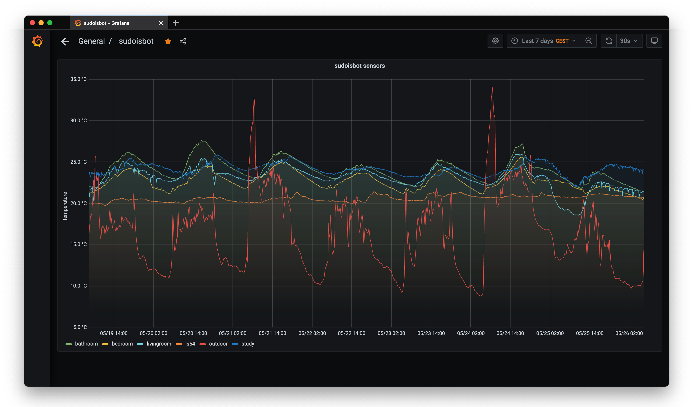

# sudoisbot

this is a home monitoring system written in python and using ZeroMQ.

i started this project to learn how to use zmq and have a project to
work on it with. the project now consists of these projects as well:

 * [zflux](https://git.sudo.is/ben/zflux): a buffering proxy (using
 zmq) to gracefully handle network failures, and can also do load
 balancing.

 * [sudoissensors](http://git.sudo.is): the code that runs on the
   actual sensor nodes, currently these are mostly Raspberry Pi Zero W
   with DHT-22 and/or ds18b20 sensors for temperature and
   humidity. Also talks to ardiunos that handle simpler analog sensors
   such as rain sensors. So far there arent that many different kinds
   of sensors supported, but the code is written to be general and
   able to functional for any kind of sensors i'd want.

# architecture

  * proxy
  * sink
  * sensor
  * apis

# license

GPL
