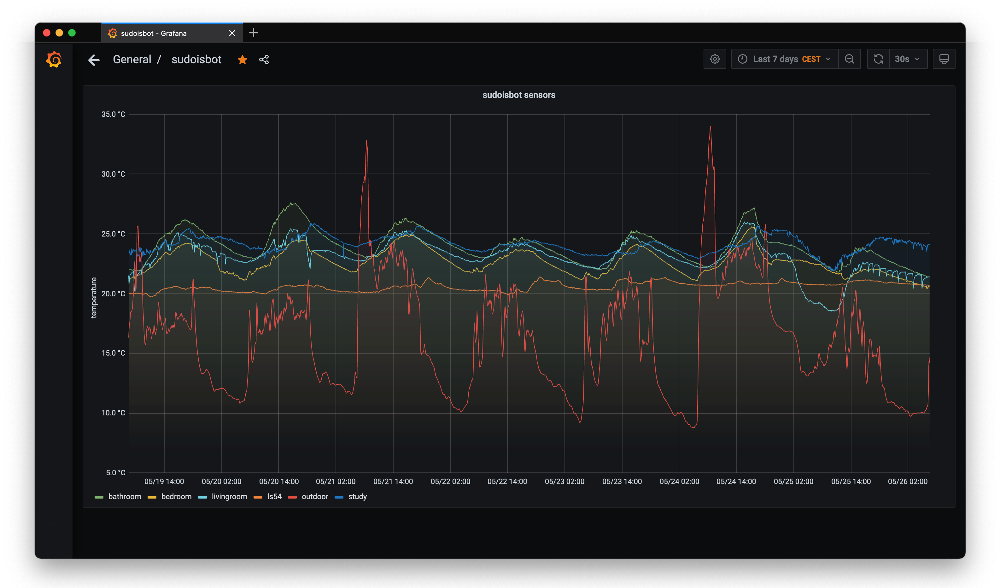

# sudoisbot

this is a home monitoring system written in python and using
[zmq](https://www.zeromq.org).

## related projects

 * [zflux](https://git.sudo.is/ben/zflux): a buffering proxy (using
 zmq) to gracefully handle network failures, and can also do load
 balancing.

## architecture

  * proxy
  * sink
  * sensor
  * apis

# license

GPL
